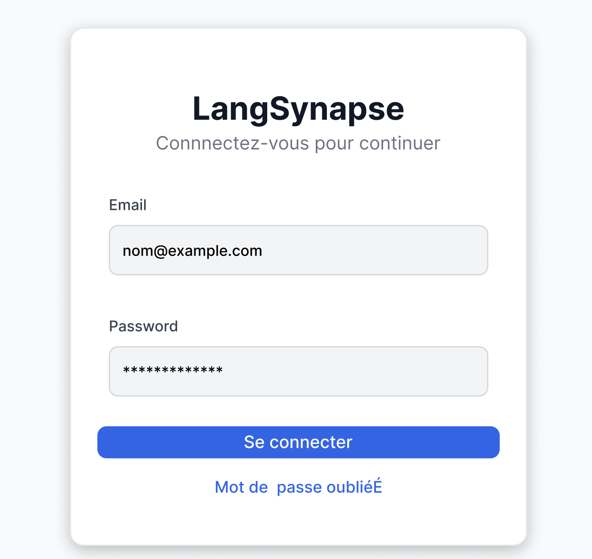
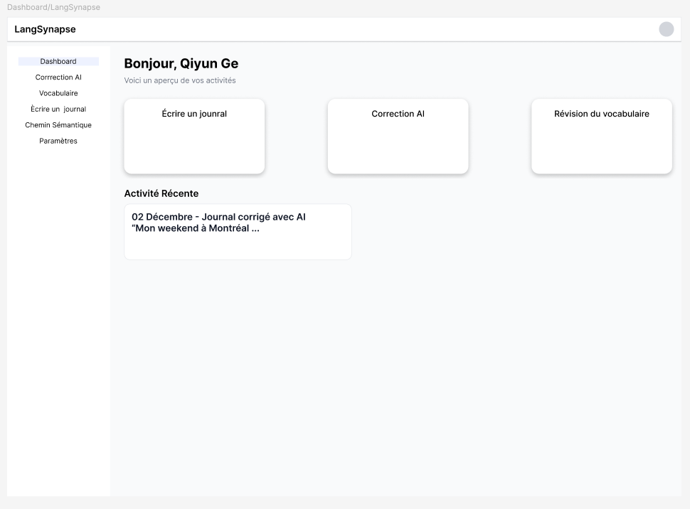

# LangSynapse — UI & Prototype Documentation

---

## 1. Introduction

LangSynapse est une plateforme d’apprentissage des langues assistée par IA.  
L’objectif du prototype est de présenter une maquette fonctionnelle des principales interfaces utilisateurs et un prototype interactif permettant de simuler l’expérience de navigation complète.

Ce document contient :

- Les maquettes (UI)
- La structure du prototype
- La description des pages
- Les flux de navigation
- Le document de test utilisateur

---

## 2. Pages (Maquettes Fonctionnelles)

Le projet inclut cinq pages principales :

---

## 2.1 Login Page

**Objectif：**  
Permettre à l’utilisateur de se connecter ou d’accéder en mode invité。

**Composants：**

- Champ Email  
- Champ Mot de passe  
- Bouton “Se connecter”  
- Lien “Mot de passe oublié ?”  

**Navigation：**
→ Home Page

---

## 2.2 Home Page

**Objectif：**  
Servir de point d’entrée pour accéder aux fonctionnalités principales。


**Composants：**

- Topbar（Logo, Search, Avatar）
- Sidebar（Dashboard / Feed / Journal / Correction / Vocabulaire / Paramètres）
- Cartes d’accès rapide

**Navigation：**
→ Dashboard  
→ Feed  
→ Journal Editor

---

## 2.3 Dashboard

**Objectif：**  
Afficher la progression de l’utilisateur。


**Composants：**

- Statistiques du jour  
- Derniers journaux  
- Dernières corrections IA  
- Croissance du vocabulaire

**Navigation：**
→ Journal Editor  
→ Correction  
→ Vocabulary

---

## 2.4 Journal Editor

**Objectif：**  
Éditer un texte et demander une correction IA。

**Composants：**

- Rich Text Editor  
- Bouton “Corriger”
- Panneau des corrections（rétractable）
- Historique

**Navigation：**
→ Correction Panel  
→ Feed

---

## 2.5 Feed Page

**Objectif：**  
Afficher les activités, recommandations IA et mises à jour。

**Composants：**

- Titre + Sous-titre  
- Plusieurs cartes：
  - Avatar  
  - Texte  
  - Image optionnelle  
  - Actions：Like / Commentaire / Enregistrer

**Navigation：**
→ Journal Editor  
→ Correction

---

## 3. Prototype — Flows & Interactions


Prototype structuré autour d’un flux principal.

---

## 3.1 Starting Frame

La page **Login** est définie comme Starting Point。

---

## 3.2 Navigation Flow

Login → Home → Dashboard → Journal Editor → Feed → Journal Editor

---

### 3.2.1 Login → Home

On click → Navigate to Home

### 3.2.2 Home → Dashboard

Click “Dashboard” → Navigate

### 3.2.3 Home → Feed

Click “Feed” → Navigate

---

## 4. Test Document

Figma prototype:

```txt
https://www.figma.com/proto/t7EVGEpcNFOn93sgouRUkc/Github-projects?node-id=235-942&t=5pU82FCk2a7Ehonq-0&scaling=min-zoom&content-scaling=fixed&page-id=2%3A2&starting-point-node-id=235%3A942
```

---

## 4.1 Test Objectif

Évaluer la facilité d’utilisation du prototype.

---

## 4.2 Test Tasks

### Tâche 1：Se connecter

- Entrer email/mot de passe  
- Cliquer “Se connecter”

**Résultat attendu：** Page Home

---

### Tâche 2：Accéder au Dashboard

- Depuis Home → “Dashboard”

**Résultat attendu：** Affichage du dashboard

---

### Tâche 3：Écrire un journal

- Ouvrir Journal Editor  
- Écrire un texte  
- Cliquer “Corriger”

**Résultat attendu：** Panneau de correction visible

---

### Tâche 4：Consulter le Feed

- Depuis Home → “Feed”  
- Cliquer une carte

**Résultat attendu：** Page Journal / Correction

---

## 4.3 Résultats

- Tâches réalisées avec succès  
- Navigation fluide  
- Interface intuitive  
- Pas de blocage majeur

---

## 5. Conclusion

Ce prototype présente les principales interfaces de LangSynapse et démontre un parcours utilisateur complet :

- Connexion  
- Navigation  
- Création de contenu  
- Correction IA  
- Consultation du fil d’actualité
