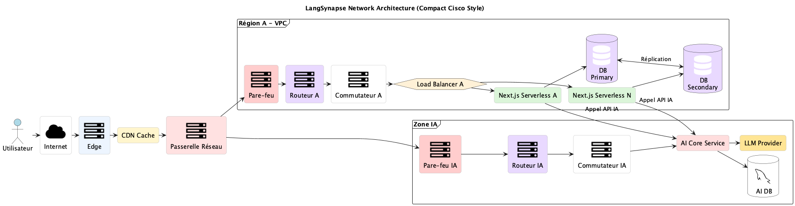

# 🛰️ Architecture Réseau de LangSynapse  

Ce document présente l’architecture réseau complète de **LangSynapse**, incluant les chemins d’accès utilisateur, la répartition CDN, la structure du VPC, les services Serverless, la réplication des bases de données, ainsi que la zone IA dédiée au traitement intelligent.

## 1. Vue d’ensemble (Overview)

L’architecture comporte :

- Accès utilisateur & Internet (Edge + CDN)  
- Région A VPC  
- Services Serverless + Load Balancer  
- Bases de données primaire / secondaire  
- Zone IA (AI Core + AI DB + Fournisseur LLM)  
- Sécurité multi‑niveaux  

## 2. Flux d’accès utilisateur

```txt
Utilisateur → Internet → Edge → CDN Cache → Passerelle Réseau → Région A (VPC)
```



## 3. Région A – VPC

- Pare‑feu, Routeur A, Commutateur A  
- Load Balancer A  
- Instances Next.js Serverless (A et N)  
- DB primaire et secondaire (réplication)

## 4. Zone IA – AI Center

- Pare‑feu IA, Routeur IA, Commutateur IA  
- AI Core Service  
- AI DB  
- Fournisseur LLM  
- Appels API sécurisés depuis Serverless  
